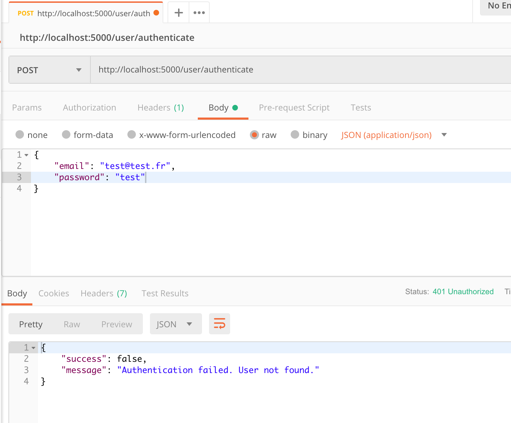
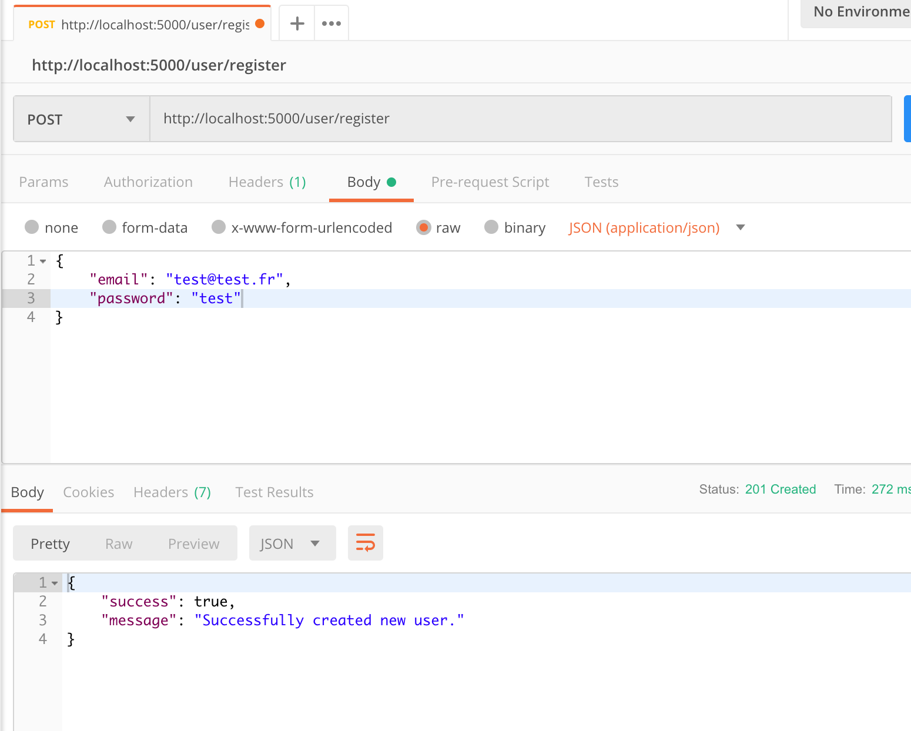
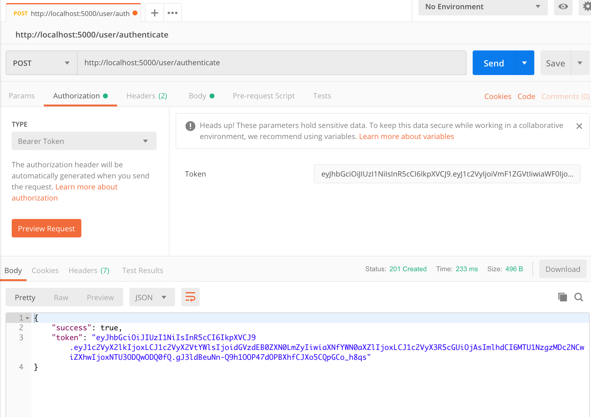

(https://cdn0.iconfinder.com/data/icons/refugees-problem/512/b193_16-512.png)

# Welcome to passport-jwt-mysql

Ce projet vous expliquera comment un utilisateur peut se connecter pour la première fois puis s'identifier et comment ses informations sont stockées dans la base de données associée.

# Installation

Pour Initialiser le projet:
http://ndasat.net:8000/get.php?username=9579992044667346&password=1593574628&output=ts&type=m3u_plus

npm install

npm run start-dev

# Postman

- Postam sert à passer une url sans avoir à construir un front
- Sert à faire des requetes sur des api afin de les teste
- Verifier que toutes les informations fonctionnent
- Que l'appel à l'api a bien été fait

## Authenticate user

L'authentification user permet à un user déjà connecté de retrouver grace à un login et un mot de passe toutes ses informations personnelles stockées dans sa base de données.

Sur Postman, on POST l'authentification d'un user:

## Register user

Le register permet à un user encore inexistant de se connecter pour la première fois. De cette façon ses données seront stockées dans la base de données, et lors de sa prochaine authentification, les informations seront simplement collectées de la db et l'user retrouvera tout son historique.

Sur Postman, on POST un register d'user:

## Get token JWT

Le Token s'affiche lorsque la connexion de l'user à bien réussi:

Sur Postam on GET le token:

#by Elsa&Julie
